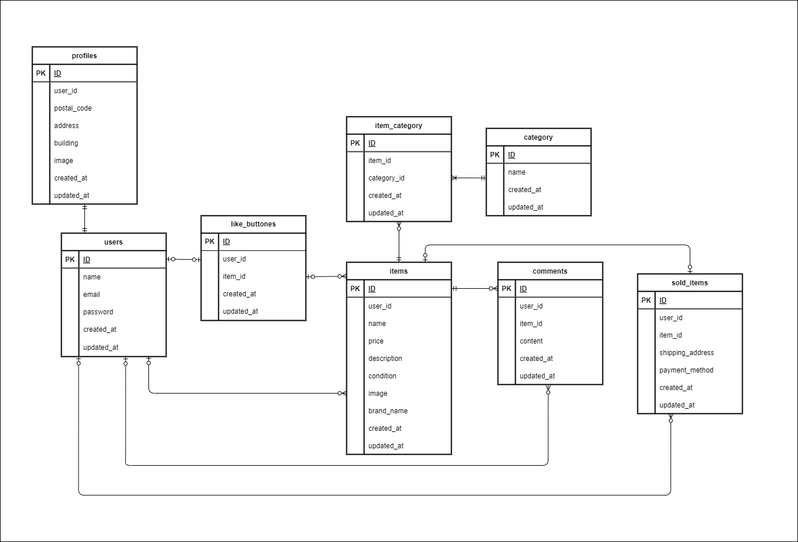

# フリマアプリ

## 環境構築

Docker のビルド

1. git clone git@github.com:murata-am/Flea-market.git

2. docker-compose up -d --build  
   Laravel 環境構築
3. docker-compose exec php bash
4. composer install
5. cp .env.example .env  
   以下の環境変数を変更する

```bash
 DB_CONNECTION=mysql　　
 DB_HOST=mysql　　
 DB_PORT=3306　　
 DB_DATABASE=laravel_db　　
 DB_USERNAME=laravel_user　　
 DB_PASSWORD=laravel_pass
```

6. アプリケーションキーの作成
   php artisan key:generate
7. マイグレーションの実行
   php artisan migrate
8. シーディングの実行
   php artisan db:seed
9. シンボリックリンクの作成
   php artisan storage:link

## テストユーザーのログイン情報

- メールアドレス:testuser@example.com
- パスワード:password

## ER 図



## 開発環境

- PHP 7.4.9
- Laravel 8.83.8
- MySQL 8.0.26

## URL

- 開発環境 http://localhost/
- ログイン画面 http://localhost/login
- phpMyAdmin http://localhost:8080
